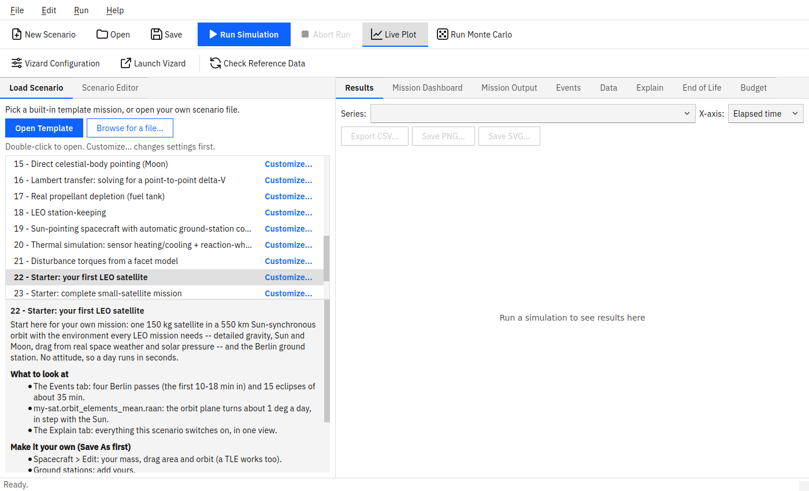
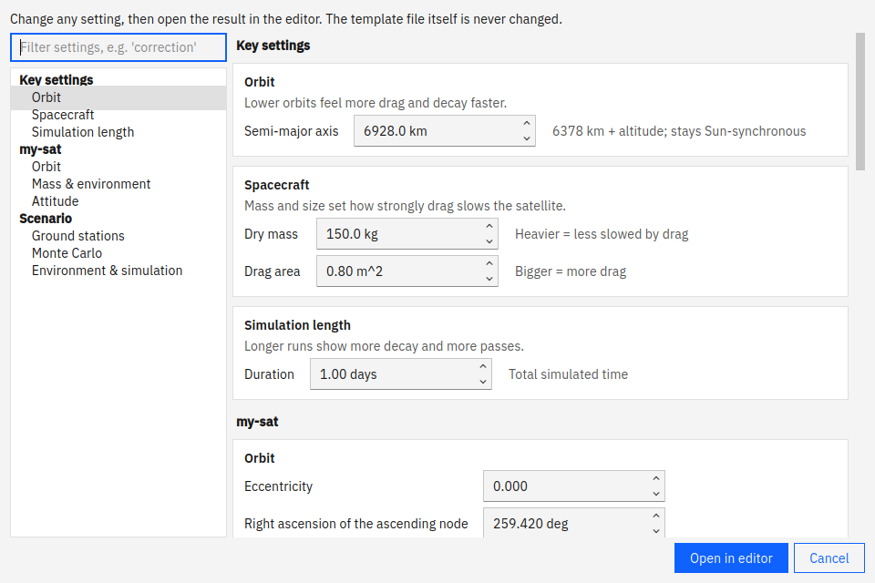
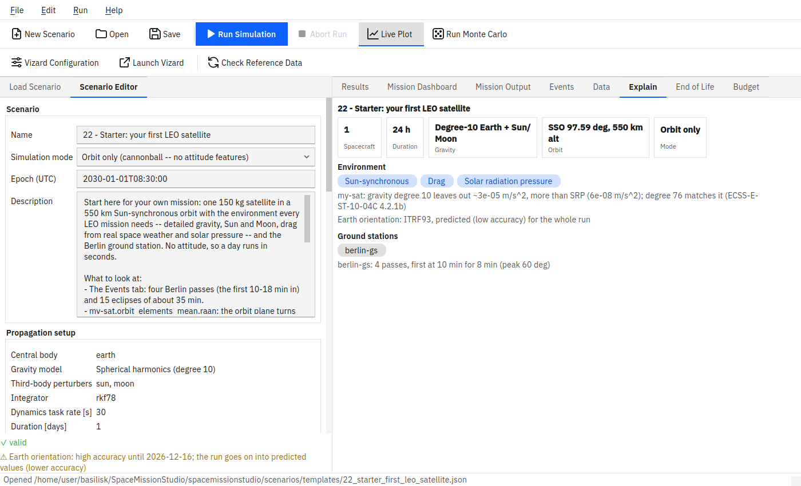

# SpaceMissionStudio User Manual

A beginner-friendly, step-by-step guide to using the SpaceMissionStudio app --
no programming and no prior spacecraft-engineering background assumed.
Every screenshot and menu label below is taken directly from the real
application.

**Looking for something else?**

* Installing SpaceMissionStudio, or developing it: see [`README.md`](README.md).
* The full technical capability list and verification status: also
  [`README.md`](README.md).
* The story of how a specific feature or bug came to be: [`HISTORY.md`](HISTORY.md).

This manual only covers *using the app once it's installed*.

## Contents

1. [What is SpaceMissionStudio?](#1-what-is-spacemissionstudio)
2. [Installing it](#2-installing-it)
3. [Starting the app](#3-starting-the-app)
4. [Your first simulation, in five minutes](#4-your-first-simulation-in-five-minutes)
5. [Tweaking a template without the full editor](#5-tweaking-a-template-without-the-full-editor)
6. [A tour of the Scenario Editor](#6-a-tour-of-the-scenario-editor)
7. [Reading the Results tab](#7-reading-the-results-tab)
8. [Saving your work](#8-saving-your-work)
9. [3D visualization with Vizard](#9-3d-visualization-with-vizard)
10. [Monte Carlo: running many variations at once](#10-monte-carlo-running-many-variations-at-once)
11. [Common questions and problems](#11-common-questions-and-problems)
12. [A short glossary](#12-a-short-glossary)
13. [Where to go next](#13-where-to-go-next)

---

## 1. What is SpaceMissionStudio?

SpaceMissionStudio is a desktop application for planning and simulating space
missions -- things like "what orbit should this satellite be in?",
"how much fuel does it take to keep a satellite parked over one spot on
Earth?", or "how does this spacecraft's pointing behave if I swap its
sensors?". You build a **scenario** (one or more spacecraft, their
starting orbits, optional sensors/actuators/ground stations), click
**Run**, and get back real physics: trajectories, fuel use, pointing
accuracy, ground-station visibility, and more.

Under the hood, every number comes from [Basilisk](http://hanspeterschaub.info/basilisk/),
a real astrodynamics simulation framework built by the University of
Colorado Boulder's Autonomous Vehicle Systems (AVS) Lab -- the same kind
of software used for real mission analysis. SpaceMissionStudio is a friendly
graphical front end over it: you never write code or touch Basilisk
directly.

You do **not** need to be an orbital-mechanics expert to get useful
results. The built-in template missions (Section 4) are a safe, guided
way to learn by doing -- pick one, run it, and see what happens before
you ever build a scenario from scratch.

## 2. Installing it

If someone already installed SpaceMissionStudio for you, skip to
[Section 3](#3-starting-the-app).

**Linux:** double-click the `.deb` file you were given (or run
`sudo apt install ./spacemissionstudio_1.0.0_all.deb` in a terminal), then
find **SpaceMissionStudio** in your application menu like any other program.

**Windows 11:** double-click the `.exe` installer you were given and
follow the setup wizard, then find **SpaceMissionStudio** in your Start Menu.

Either installer needs an internet connection the first time it runs, to
download the Basilisk simulation engine (this only happens once).

**Don't have an installer, or want to run it from source instead?** See
the "Getting started" section of [`README.md`](README.md) -- it walks
through the handful of terminal commands needed (`pip install`, mostly)
and is written for someone comfortable typing commands, not a programmer.

## 3. Starting the app

* **Installed via `.deb`/`.exe`:** open **SpaceMissionStudio** from your
  application menu/Start Menu, same as any other program.
* **Running from source:** open a terminal in the project folder and run
  `spacemissionstudio gui` (or `python3 -m spacemissionstudio.gui.app`).

The window that opens looks like this:

A few things to notice right away:

* **File / Run / Help** along the top -- the three menus you'll use
  for almost everything.
* A row of toolbar buttons just below the menus, mirroring the most
  common menu actions (New Scenario, Open, Save, Run Simulation, ...)
  so you don't have to open a menu every time.
* Two tabs on the **left**: **Load Scenario** (where you start) and
  **Scenario Editor** (where you build/edit a mission in detail --
  Section 6).
* Five tabs on the **right**: **Results**, **Mission Dashboard**,
  **Mission Output**, **Kernel Status** (all empty until you run
  something), and **Explain** (a live, always-current summary of
  what the scenario you're currently editing actually does -- see
  the end of Section 7).

The app opens on the **Load Scenario** tab deliberately: picking a
starting point is the natural first move for everyone, whether you end
up using a template as-is or editing it into something new.

## 4. Your first simulation, in five minutes

1. **Pick a template.** The list on the left shows all twenty
   built-in example missions, numbered roughly from simplest to most
   advanced -- "01 - Two-body circular orbit" is the simplest possible
   case (one satellite, one orbit, nothing else going on) and a good
   first choice. Click it once; its description appears below the list,
   explaining what it demonstrates and what to look for.
2. Click **Open Template** (or just double-click the list entry). The
   app switches to the **Scenario Editor** tab with that mission loaded
   -- you don't need to look at or understand this tab yet, just confirm
   something loaded (its name appears in the "Name" field at the top).
3. Open the **Run** menu and choose **Run Simulation** (or click the
   matching toolbar button, or press `Ctrl+R`). The status bar at the
   bottom shows progress; a short run like this one finishes in seconds.
4. When it finishes, the app switches to the **Results** tab
   automatically. Pick a series from the **Series** dropdown (e.g. a
   spacecraft's position) to see it plotted. Hover over the plot to read
   exact values at any point.
5. Done exploring? **Export CSV...** saves every plotted
   quantity to a folder of `.csv` files you can open in a spreadsheet.

That's the whole loop: **pick -> open -> run -> look at Results.**
Every other feature in the app builds on top of this one. Try a few
more templates before moving on -- the list's own descriptions (and
[`spacemissionstudio/scenarios/templates/README.md`](spacemissionstudio/scenarios/templates/README.md))
tell you what each one teaches, from simple circular orbits up through
constellations, formation flying, attitude control, and propellant
tracking.

**Nothing happened when you clicked Run?** See
[Section 11](#11-common-questions-and-problems) -- the most common
cause is that Basilisk, the simulation engine itself, isn't installed
yet; the app will say so clearly rather than failing silently.

## 5. Tweaking a template without the full editor

Say "02 - Elliptical orbit with perturbations" is close to what you
want, but you'd like a different inclination or duration, without
learning the full Scenario Editor. Every row in the Load Scenario
tab's template list has its own **Customize...** button on its right
-- click the one on that template's row (no need to select the row
first):

Clicking one opens a short, guided wizard over just that template's own
handful of most-interesting settings (pre-filled with its current
values) -- **Next**/**Back** through a couple of pages, change only what
you care about, then **Finish**. The result opens directly in the
Scenario Editor, ready to run, with everything else left exactly as the
original template had it. The original template file on disk is never
modified either way, whether you use this wizard or the full editor --
so you can always come back to a clean copy later.

## 6. A tour of the Scenario Editor

You don't need to understand every field here to use SpaceMissionStudio --
most people start from a template (Section 4) or its customize wizard
(Section 5) and never touch most of this. This section is for when you
want to build something more specific, or just want to know what you're
looking at.

The form is organized top to bottom, roughly in the order you'd fill it
out for a brand-new scenario:

* **Scenario** -- the mission's name, its **Simulation mode**
  ("Full attitude" if you need sensors/actuators/pointing control, or
  the simpler "Orbit only" if you just care about trajectories), the
  **Epoch** (the real calendar date/time the simulation starts, in UTC),
  and a free-text **Description**.
* **Propagation setup** -- a read-only summary (central body, gravity
  model, integrator, duration, atmosphere) with one **Edit Propagation
  Setup...** button that opens a dedicated window for changing any of
  it: which planet you're orbiting, how detailed its gravity model is,
  which other bodies' gravity to include (Sun, Moon, ...), the numerical
  integrator, how long to simulate, and atmospheric drag/space-weather
  settings.
* **Spacecraft** -- the list of spacecraft in the mission. **Add...**
  opens a dialog with its own tabs: orbit & mass, sensors/actuators,
  attitude control, power/propulsion, and a cosmetic 3D-model tab for
  Vizard (Section 9). An orbit can be specified as classical orbital
  elements (semi-major axis, eccentricity, inclination, ...), Cartesian
  position/velocity, or a TLE (the format real tracked satellites are
  published in) -- pick whichever you have on hand. There are also
  **Generate Walker constellation...** and **Generate phasing
  formation...** buttons here for building multi-satellite setups
  automatically instead of adding spacecraft one at a time.
* **Ground stations** -- optional stations on the ground to check
  visibility/communication with (each spacecraft's contact windows,
  signal link margin, etc.).
* **Mission sequence** -- an optional, ordered list of commands (coast
  for a while, do a burn, take a snapshot, ...) for missions more
  complex than "just propagate forward for N days".
* **Monte Carlo** -- see Section 10.

A **validation message** at the very bottom of this tab updates live as
you type, in plain language (e.g. naming exactly which field is missing
or invalid) -- you don't have to guess why Run is unavailable.

## 7. Reading the Results tab

After a run finishes, the **Results** tab shows one plot at a time:

* **Series** -- pick which quantity to look at, listed by plot title
  (e.g. "sat-1: Inertial Position (ECI)"). Type to filter the list.
  Hover an entry to see its code name (e.g. `sat-1.position_N`), which
  is also its CSV file name.
* **Suggested** -- one-click shortcuts to the series the scenario's own
  description points at under "What to look at" (e.g. template 19's
  access window, pointing error, battery and link margin). A new run
  opens on the first of them. For your own scenarios, write series names
  in that section of the Description and they show up here too.
* **X-axis** -- toggle between elapsed simulation time and the real
  calendar epoch, whichever you find easier to read.
* **Export CSV...** -- saves every series (not just the current one) to
  `.csv` files in SI units, for a spreadsheet or another tool.
  **Save PNG...** / **Save SVG...** save just the plot on screen.
* **View** -- only shown when the scenario has ground stations:
  "Access timeline" shows every station's passes over every spacecraft
  in one chart.

A line under the buttons names what produced the result (versions,
integrator and step, run time). If an orbit-only run's energy or angular
momentum drifts, an amber note appears there too: try a smaller
dynamics step or a higher-order integrator.

The plot is interactive: hover to see exact values, and use your
scroll wheel/drag to zoom and pan.

**Mission Output** (the tab next to Results) shows what each `report`
command in a Mission Sequence run (Section 6) recorded: one row per
quantity and one column per report, in the same units as the plots.
With exactly two reports (e.g. "Before burn" / "After burn") a
**Change** column shows the difference. Type in **Filter** to narrow it
to a report or a quantity; **Export CSV...** always writes every report
in SI units. Without a Mission Sequence you can ignore this tab.

**Kernel Status** shows whether the SPICE data files Basilisk needs
(planetary positions, leap seconds, etc.) are downloaded and current --
see [Section 11](#11-common-questions-and-problems) if Run ever
complains about missing kernels.

**Explain** is different from the other four tabs: it doesn't need a
run at all, and it updates live as you edit the Scenario Editor. It's a
short, at-a-glance recipe of what the CURRENT scenario is actually
configured to do -- a handful of stat tiles (spacecraft count,
duration, gravity model, ...), colored badges for what's turned on
(station-keeping, Sun-synchronous, drag, ...), and, once a scenario has
two or more spacecraft, a side-by-side comparison table. It never shows
prose -- where a badge uses a term you don't recognize (Sun
-synchronous, spherical-harmonics gravity, ...), check the glossary in
[Section 12](#12-a-short-glossary). Unlike the free-text Description
box at the top of the Scenario Editor (which is hand-written and only
really meaningful for the bundled templates), Explain is built fresh
from the scenario's actual current fields every time, so it's never out
of date -- useful for checking that a bespoke scenario you built from
scratch actually ended up configured the way you intended.

Explain also checks the scenario before you run it:

* **Ground stations** lists each station's predicted passes in this run,
  e.g. "berlin-gs: 2 passes, first at 10 min (peak 61 deg)". The
  prediction uses each spacecraft's starting orbit (with Earth's J2 drift
  when the gravity model includes it), so maneuvers and drag aren't
  included.
* **Check before running** appears at the top when something can't work
  as configured, and the tab's title then reads "Explain (1 to check)":
  a station that is never in view during the run, or whose first pass
  comes late; a Sun-pointing spacecraft with no sun sensor on its
  Sun-facing side; or station-keeping with drag off, whose deadband may
  never trip. These are warnings only; the run still works.

## 8. Saving your work

**File > Save** (or **Save As...** for a new file/location) writes your
current scenario to a `.json` file you choose. **File > Open...** loads
one back. **File > New Scenario** clears the editor and starts fresh.

If you started from a template or its customize wizard, **use Save
As...** to give your edited copy its own name/location -- the original
template file is never overwritten automatically, so you can always
start over from a clean copy.

## 9. 3D visualization with Vizard

Vizard is AVS's separate 3D visualization application -- it shows your
spacecraft, orbit, and attitude moving in real time (or played back
afterward) instead of just plots of numbers.

* **Run > Vizard Configuration...** decides how the *next* run feeds
  Vizard -- live streaming while the simulation runs, or saving a
  playback file to watch afterward.
* **Run > Launch Vizard** starts the separate Vizard application itself.
  If SpaceMissionStudio can't find it already installed, it offers to
  download AVS's own pre-built copy for you automatically.

Vizard is entirely optional -- plots in the Results tab already show
everything numerically; Vizard is for *seeing* the mission.

## 10. Monte Carlo: running many variations at once

Real spacecraft never have perfectly known mass, attitude, etc. --
**Monte Carlo** mode runs your scenario many times with small, randomized
variations (currently: dry mass and/or starting attitude) and reports
the spread of outcomes, instead of one single result. In the Scenario
Editor's **Monte Carlo** section, check **Enabled**, set how many runs
and how many to run in parallel, and add one or more **dispersions**
(which quantity varies, and by how much) -- then use **Run > Run Monte
Carlo...** instead of the ordinary Run Simulation. This is a more
advanced feature; most people won't need it for a first mission.

## 11. Common questions and problems

**"Run Simulation" says Basilisk isn't installed/built.**
SpaceMissionStudio's graphical shell opens fine on its own, but actually
*running* a simulation needs the separate Basilisk engine installed too.
If you used the `.deb`/`.exe` installer, this should already be set up;
if not, see "Getting started" in [`README.md`](README.md). The app
always reports this clearly rather than crashing -- if you see a plain
error message naming Basilisk, that's exactly what's going on, not a bug.

**The first run (or Check Kernels) is slow / needs the internet.**
The very first time anything touches real planetary/time data, Basilisk
downloads a set of standard reference files (called SPICE kernels --
leap seconds, planet positions, around 100 MB total) and caches them
locally. This needs internet access once; after that, runs use the
cached copy. **Run > Check Kernels** tells you exactly what's
missing/cached, rather than failing silently mid-run.

**The Results plot area stays blank after a run.** The plots run inside
an embedded web-rendering component. On a very minimal Linux install,
you may need a few extra system libraries -- see "Running the tests" in
[`README.md`](README.md) for the exact package names if this happens.

**A simulation is taking too long, or you started the wrong one.**
**Run > Abort Run** stops it safely at the next checkpoint (not
instantly) and keeps whatever partial results were already produced --
it's always safe to use, never a forced/unsafe kill.

**You're not sure what a field in the Scenario Editor means.** Hover
over it -- most fields have a tooltip explaining what it does in plain
language. The validation message at the bottom of the Scenario Editor
also explains, in plain language, exactly what's wrong if something
doesn't validate.

**You want to know SpaceMissionStudio's version** (e.g. to report a problem).
**Help > About SpaceMissionStudio** shows it.

## 12. A short glossary

Plain-language explanations of terms you'll run into in the app, for
anyone who hasn't worked with spacecraft before:

* **Epoch** -- the real calendar date/time a simulation starts at (e.g.
  `2030-01-01T00:00:00` UTC). Needed because gravity from the Sun/Moon,
  atmospheric density, and a satellite's position relative to the
  ground all depend on exactly *when* you're simulating, not just how
  long.
* **Orbit (classical) elements** -- six numbers that describe an orbit's
  size, shape, and orientation in space: semi-major axis (roughly, the
  orbit's average size), eccentricity (how stretched/elliptical it is),
  inclination (tilt relative to the equator), RAAN and argument of
  periapsis (orientation), and an anomaly (where the spacecraft starts
  along that orbit).
* **TLE** -- "Two-Line Element set", the compact text format real
  tracked satellites' orbits are published in (e.g. by
  [celestrak.org](https://celestrak.org)) -- a second way to describe a
  starting orbit, if you already have one.
* **Attitude** -- which way a spacecraft is *pointing* (as opposed to
  where it *is*). "Attitude control" is keeping a spacecraft pointed at
  a target (the ground, the Sun, a planet, ...).
* **FSW (Flight Software) mode** -- which built-in attitude-pointing
  behavior a spacecraft uses, e.g. pointing nadir (straight down at the
  ground), at the Sun, or at a ground station.
* **Sensors/actuators** -- hardware a spacecraft can carry: sensors
  (star trackers, sun sensors, ...) measure where it's pointing;
  actuators (reaction wheels, thrusters, magnetic torque rods) change
  where it's pointing or correct its orbit.
* **Station-keeping** -- firing small thruster burns periodically to
  correct a satellite's orbit as it naturally drifts (from gravity
  irregularities, drag, etc.), so it stays where it's supposed to be.
* **Phasing (along-track separation)** -- how far ahead of or behind
  another spacecraft (the "chief") a satellite sits along the SAME
  orbit, measured as a distance along the direction of travel.
  "Phasing-keeping" holds that separation steady over time, the same
  way station-keeping holds altitude steady.
* **Sun-synchronous orbit** -- an orbit whose plane rotates (from
  Earth's own gravity being slightly non-spherical) at exactly the same
  rate the Sun appears to move around the sky over a year -- so the
  satellite crosses any given latitude at the same local solar time on
  every pass. The most common choice for Earth-observation satellites,
  since lighting conditions on the ground stay consistent.
* **Spherical-harmonics gravity** -- a more detailed model of a
  planet's gravity than "a single point mass at the center" -- it
  accounts for the planet's real, slightly lumpy/non-spherical shape
  (Earth bulges at the equator, for instance). Higher "degree" means
  more detail, at the cost of more computation.
* **Third-body perturbation** -- the small extra pull on a spacecraft
  from a body OTHER than the one it's orbiting -- e.g. the Sun or Moon's
  gravity acting on a satellite orbiting Earth. Usually a small effect
  next to the central body's own gravity, but real over long enough runs.
* **Ground station** -- a fixed point on Earth's surface a spacecraft
  might need to communicate with; SpaceMissionStudio can compute exactly
  when each spacecraft is visible to each ground station.
* **Delta-V** -- how much a spacecraft's velocity changes from a
  maneuver/burn; the standard way to measure "how much fuel does this
  cost", independent of the specific spacecraft.
* **Monte Carlo** -- running the same scenario many times with small
  random variations, to see a *range* of outcomes instead of one
  single answer (see Section 10).
* **SPICE kernels** -- the reference data files (planet positions, leap
  seconds, etc.) Basilisk needs for real-world time/position math (see
  Section 11).

## 13. Where to go next

* **More templates to learn from:**
  [`spacemissionstudio/scenarios/templates/README.md`](spacemissionstudio/scenarios/templates/README.md)
  describes what each of the twenty built-in templates teaches, in
  more depth than the in-app description box.
* **The full feature list and technical details:** [`README.md`](README.md)'s
  "Capabilities" section.
* **How a specific feature or fix came to be, including real bugs found
  and fixed along the way:** [`HISTORY.md`](HISTORY.md).
