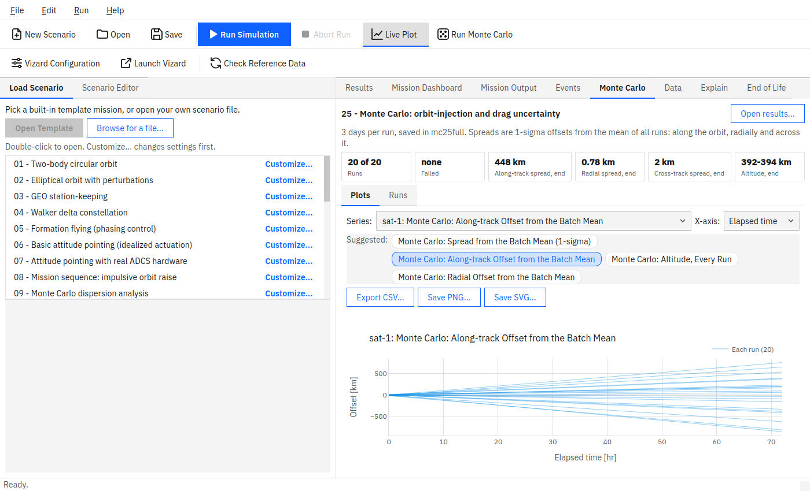

# SpaceMissionStudio User Manual

A beginner-friendly, step-by-step guide to using the SpaceMissionStudio app --
no programming and no prior spacecraft-engineering background assumed.
Every screenshot and menu label below is taken directly from the real
application.

**Looking for something else?**

* Installing SpaceMissionStudio: [`GETTING_STARTED.md`](GETTING_STARTED.md),
  step by step for Linux and Windows.
* Using it from Python scripts: [`examples/`](examples/README.md).
* The full technical capability list and verification status:
  [`README.md`](README.md).
* The story of how a specific feature or bug came to be: [`HISTORY.md`](HISTORY.md).

This manual only covers *using the app once it's installed*.

## Contents

1. [What is SpaceMissionStudio?](#1-what-is-spacemissionstudio)
2. [Installing it](#2-installing-it)
3. [Starting the app](#3-starting-the-app)
4. [Your first simulation, in five minutes](#4-your-first-simulation-in-five-minutes)
5. [Tweaking a template without the full editor](#5-tweaking-a-template-without-the-full-editor)
6. [A tour of the Scenario Editor](#6-a-tour-of-the-scenario-editor)
7. [Reading the Results tab](#7-reading-the-results-tab)
8. [Saving your work](#8-saving-your-work)
9. [3D visualization with Vizard](#9-3d-visualization-with-vizard)
10. [Monte Carlo: running many variations at once](#10-monte-carlo-running-many-variations-at-once)
11. [Common questions and problems](#11-common-questions-and-problems)
12. [A short glossary](#12-a-short-glossary)
13. [Where to go next](#13-where-to-go-next)

---

## 1. What is SpaceMissionStudio?

SpaceMissionStudio is a desktop application for planning and simulating space
missions -- things like "what orbit should this satellite be in?",
"how much fuel does it take to keep a satellite parked over one spot on
Earth?", or "how does this spacecraft's pointing behave if I swap its
sensors?". You build a **scenario** (one or more spacecraft, their
starting orbits, optional sensors/actuators/ground stations), click
**Run**, and get back real physics: trajectories, fuel use, pointing
accuracy, ground-station visibility, and more.

Under the hood, every number comes from [Basilisk](http://hanspeterschaub.info/basilisk/),
a real astrodynamics simulation framework built by the University of
Colorado Boulder's Autonomous Vehicle Systems (AVS) Lab -- the same kind
of software used for real mission analysis. SpaceMissionStudio is a friendly
graphical front end over it: you never write code or touch Basilisk
directly.

You do **not** need to be an orbital-mechanics expert to get useful
results. The built-in template missions (Section 4) are a safe, guided
way to learn by doing -- pick one, run it, and see what happens before
you ever build a scenario from scratch.

### How the pieces fit together

Everything revolves around one **scenario**: a single `.json` file that
describes the whole mission. **Run** turns that description into results.

```
Scenario (one .json file)
 |- Epoch and simulation mode ... when it starts; orbit only, or orbit + attitude
 |- Propagation setup ........... planet, gravity detail, Sun/Moon, atmosphere, duration
 |- Spacecraft (one or more)
 |   |- Orbit ................... where it starts: orbital elements, position/velocity or a TLE
 |   |- Mass and shape .......... mass, inertia, drag and sunlight areas (or flat plates)
 |   |- Hardware ................ sensors, wheels, torque rods, thrusters, tank, battery, radio
 |   '- Control ................. pointing mode, station keeping, formation keeping
 |- Ground stations ............. where on Earth, lowest usable elevation, receiver
 |- Mission sequence (optional) . coast, burn, report, step by step
 '- Monte Carlo (optional) ...... which values vary between runs, and by how much
          |
          |  Run: Basilisk computes the physics
          v
Results: a plot of every quantity, an Events timeline, mission reports,
         a dashboard, CSV export, a 3D replay in Vizard
```

Where each piece lives in the app, and which template shows it best:

| Piece | Where you edit it | Learn it from template |
|---|---|---|
| Simulation mode, epoch | Scenario Editor, top | 01 (orbit only), 06 (attitude) |
| Gravity, Sun and Moon, atmosphere, duration | Scenario Editor > **Edit Propagation Setup...** | 02, 18 |
| A spacecraft's orbit and mass | Spacecraft > **Add...** / **Edit...** > **Orbit / mass** | 01, 22 |
| Sensors and actuators | ... > **Sensors / actuators** | 07, 12, 13, 14 |
| Where it points | ... > **Attitude control** | 06, 15, 19 |
| Power, thrusters, radio | ... > **Power / propulsion / link budget** | 07, 17, 18, 19 |
| Instruments, memory, downlink | ... > **Power / propulsion / link budget** > Data handling | 26 |
| Ground stations | Scenario Editor > Ground stations | 19, 22 |
| Mission sequence | Scenario Editor > Mission sequence | 08, 16, 23 |
| Monte Carlo | Scenario Editor > Monte Carlo | 09, 25 |
| Results | the tabs on the right (Section 7) | any |

**Orbit only or full attitude?** *Orbit only* simulates where each
spacecraft goes: fast, and enough for orbits, drag, station keeping,
formations and ground passes. *Full attitude* also simulates which way it
points, so sensors, wheels, torque rods, pointing modes, flat-plate
shapes and power from a Sun-facing panel become available; it needs a
small time step and runs slower. Start with orbit only and switch when
you need pointing.

## 2. Installing it

If someone already installed SpaceMissionStudio for you, skip to
[Section 3](#3-starting-the-app).

**Linux:** double-click the `.deb` file you were given (or run
`sudo apt install ./spacemissionstudio_2.0.0_all.deb` in a terminal), then
find **SpaceMissionStudio** in your application menu like any other program.

**Windows 10/11:** double-click the `.exe` installer you were given and
follow the setup wizard, then find **SpaceMissionStudio** in your Start Menu.

Either installer needs an internet connection once, to download the
Basilisk simulation engine and its reference data (planet positions,
leap seconds, Earth's gravity and magnetic field, about 116 MB). After
that the app works offline.

**No installer, or want to run it from source?**
[`GETTING_STARTED.md`](GETTING_STARTED.md) walks through every way to
install it, with copy-and-paste commands, how to check that it works,
and what to do when it doesn't.

## 3. Starting the app

* **Installed via `.deb`/`.exe`:** open **SpaceMissionStudio** from your
  application menu/Start Menu, same as any other program.
* **Running from source:** open a terminal in the project folder and run
  `spacemissionstudio gui` (or `python3 -m spacemissionstudio.gui.app`).

The window that opens looks like this:


A few things to notice right away:

* **File / Edit / Run / Help** along the top -- the four menus you'll
  use for almost everything.
* A row of toolbar buttons just below the menus, mirroring the most
  common menu actions (New Scenario, Open, Save, Run Simulation, ...)
  so you don't have to open a menu every time.
* Two tabs on the **left**: **Load Scenario** (where you start) and
  **Scenario Editor** (where you build/edit a mission in detail --
  Section 6).
* Eight tabs on the **right**. **Results**, **Mission Dashboard**,
  **Mission Output** and **Events** fill in when you run something
  (Section 7). **Data** lists the reference files and offers to
  download missing ones. **Explain** is a live summary of what the
  scenario you are editing does (end of Section 7). **End of Life** and
  **Budget** estimate re-entry and delta-V (Section 11). A ninth,
  **Monte Carlo**, appears when the scenario has Monte Carlo on
  (Section 10).
* The status bar at the bottom shows progress and, if it is not the
  verified 2.12.0, the Basilisk version.

The app opens on the **Load Scenario** tab deliberately: picking a
starting point is the natural first move for everyone, whether you end
up using a template as-is or editing it into something new.

## 4. Your first simulation, in five minutes

1. **Pick a template.** The list on the left shows all twenty-five
   built-in example missions, numbered roughly from simplest to most
   advanced -- "01 - Two-body circular orbit" is the simplest possible
   case (one satellite, one orbit, nothing else going on) and a good
   first choice. Click it once; its description appears below the list,
   explaining what it demonstrates and what to look for.
2. Click **Open Template** (or just double-click the list entry). The
   app switches to the **Scenario Editor** tab with that mission loaded
   -- you don't need to look at or understand this tab yet, just confirm
   something loaded (its name appears in the "Name" field at the top).
3. Open the **Run** menu and choose **Run Simulation** (or click the
   matching toolbar button, or press `Ctrl+R`). The status bar at the
   bottom shows progress; a short run like this one finishes in seconds.
4. When it finishes, the app switches to the **Results** tab
   automatically. Pick a series from the **Series** dropdown (e.g. a
   spacecraft's position) to see it plotted. Hover over the plot to read
   exact values at any point.
5. Done exploring? **Export CSV...** saves every plotted
   quantity to a folder of `.csv` files you can open in a spreadsheet.

That's the whole loop: **pick -> open -> run -> look at Results.**
Every other feature in the app builds on top of this one. Try a few
more templates before moving on -- the list's own descriptions (and
[`spacemissionstudio/scenarios/templates/README.md`](spacemissionstudio/scenarios/templates/README.md))
tell you what each one teaches, from simple circular orbits up through
constellations, formation flying, attitude control, and propellant
tracking.

**Nothing happened when you clicked Run?** See
[Section 11](#11-common-questions-and-problems) -- the most common
cause is that Basilisk, the simulation engine itself, isn't installed
yet; the app will say so clearly rather than failing silently.

### Which template next?

Each template shows one idea, so a few at a time is plenty. A suggested
path, each step building on the one before:

| Step | Templates | What you learn |
|---|---|---|
| 1. Orbits | 01, 02, 22 | An ideal orbit; what Earth's shape, the Sun and the Moon do to it; a realistic satellite with drag and a ground station |
| 2. Keeping an orbit | 18, 03, 17 | Station keeping against drag (low orbit) and drift (geostationary); how propellant runs down |
| 3. Pointing | 06, 07, 15, 14, 27 | Attitude control, ideal and with real hardware; pointing at the Moon; finding the Sun with sun sensors; flexible wings swinging in a turn |
| 4. Disturbances and momentum | 10, 21, 12, 13, 11 | Gravity-gradient and surface torques; unloading wheels with thrusters or torque rods; thrusters for pointing |
| 5. Missions in steps | 08, 16, 23 | Mission Sequences: burns, a Lambert transfer, stopping on a ground pass |
| 6. Several spacecraft | 04, 05, 24 | A Walker constellation; a formation held by two different control laws |
| 7. Whole systems | 19, 20, 23, 26 | Power, radio link and thermal working together; data from instrument to ground |
| 8. Uncertainty | 09, 25 | Monte Carlo batches: mass, orbit insertion, drag |

**Starting your own mission?** Open **22** (a realistic satellite, orbit
only) or **23** (a complete small satellite with hardware, a radio link
and a Mission Sequence), use **File > Save As...**, and change it step
by step (Section 6).

## 5. Tweaking a template without the full editor

Say "22 - Starter: your first LEO satellite" is close to what you
want, but you'd like a lower orbit or a heavier satellite, without
learning the full Scenario Editor. Every row in the Load Scenario
tab's template list has its own **Customize...** button on its right
-- click the one on that template's row (no need to select the row
first):


It opens one window with every setting of that template, pre-filled
with its current values: the handful that matter most under **Key
settings** at the top, then everything else grouped by spacecraft and
topic. The list on the left jumps to a section; the filter box finds a
setting by name ("drag", "duration"). Change what you like, then
**Open in editor**: the result opens in the Scenario Editor, ready to
run. The original template file on disk is never modified, whether you
use this dialog or the full editor -- so you can always come back to a
clean copy later.

## 6. A tour of the Scenario Editor

You don't need to understand every field here to use SpaceMissionStudio --
most people start from a template (Section 4) or its customize wizard
(Section 5) and never touch most of this. This section is for when you
want to build something more specific, or just want to know what you're
looking at.


The form is organized top to bottom, roughly in the order you'd fill it
out for a brand-new scenario:

* **Scenario** -- the mission's name, its **Simulation mode**
  ("Full attitude" if you need sensors/actuators/pointing control, or
  the simpler "Orbit only" if you just care about trajectories), the
  **Epoch** (the real calendar date/time the simulation starts, in UTC),
  and a free-text **Description**.
* **Propagation setup** -- a read-only summary (central body, gravity
  model, integrator, duration, atmosphere) with one **Edit Propagation
  Setup...** button that opens a dedicated window for changing any of
  it: which planet you're orbiting, how detailed its gravity model is,
  which other bodies' gravity to include (Sun, Moon, ...), the numerical
  integrator, how long to simulate, and atmospheric drag/space-weather
  settings.
* **Spacecraft** -- the list of spacecraft in the mission. **Add...**
  opens a dialog with its own tabs: **Orbit / mass**, **Sensors /
  actuators**, **Attitude control**, **Power / propulsion / link
  budget**, a cosmetic **Vizard model** tab (Section 9) and **Budget
  (AD10)** (Section 11). **New from template...** adds a complete
  spacecraft from a 100-500 kg preset instead of a blank one. An orbit can be specified as classical orbital
  elements (semi-major axis, eccentricity, inclination, ...), Cartesian
  position/velocity, or a TLE (the format real tracked satellites are
  published in) -- pick whichever you have on hand. There are also
  **Generate Walker constellation...** and **Generate phasing
  formation...** buttons here for building multi-satellite setups
  automatically instead of adding spacecraft one at a time.
  On the orbit & mass tab, **Surface facets** describes the spacecraft as
  flat plates (**Box + solar array...** fills in a bus and an array).
  Drag and solar pressure then follow the attitude, and an off-centre
  plate adds a torque the wheels must absorb (template 21).
* **Ground stations** -- optional stations on the ground to check
  visibility/communication with (each spacecraft's contact windows,
  signal link margin, etc.).
* **Mission sequence** -- an optional, ordered list of commands (coast
  for a while, do a burn, take a snapshot, ...) for missions more
  complex than "just propagate forward for N days". A propagate can stop
  after a duration, at an epoch, or at an event: periapsis, apoapsis, or
  the start or end of the next pass over a ground station
  (`pass_start`/`pass_end`). A `pass_start` issued during a pass waits
  for the next one. The Explain tab lists each station's first pass and
  how long it lasts.
* **Monte Carlo** -- see Section 10.

A **validation message** at the very bottom of this tab updates live as
you type, in plain language (e.g. naming exactly which field is missing
or invalid) -- you don't have to guess why Run is unavailable.

### Building your own scenario, step by step

The quickest way to a mission of your own is a starter template (22 or
23) and **Save As**. To start from an empty scenario instead:

1. **File > New Scenario.** Give it a **Name**. Choose **Simulation
   mode** *Orbit only* to begin with (Section 1 explains the choice) and
   set the **Epoch (UTC)**: the date decides where the Sun and Moon are,
   how dense the upper atmosphere is and when ground stations see you.
2. **Edit Propagation Setup...** For a satellite around Earth: tick
   **Enable spherical-harmonics gravity** with degree 10, add **sun** and
   **moon** as third-body perturbers, start with a **Duration** of 1 day,
   and leave the atmosphere on the bundled, real space-weather data.
3. **Spacecraft > Add...**, or **New from template...** for a 100-500 kg
   preset (in *Orbit only* mode it keeps the preset's mass, inertia and
   drag areas and leaves its hardware out). On **Orbit / mass**: the semi-major axis is Earth's
   radius (6378 km) plus the altitude, so 6928 km for 550 km. For an
   Earth-observation orbit, press **Compute Sun-sync inclination for
   this altitude** and **Compute RAAN for LTAN...** (10:30 is the usual
   local time). Have a real satellite's TLE? Choose the TLE orbit type
   and paste it. Then set the **Dry mass**, and tick **Enable atmospheric
   drag** with its area (and **Enable solar radiation pressure**).
4. **Ground stations > Add...**: a name, latitude, longitude and the
   lowest usable elevation (10 deg is common).
5. Look at the bottom of the tab: **✓ valid** means Run is available;
   otherwise the message names the field to fix. The **Explain** tab
   already shows the orbit type, the ground passes and what the
   environment includes, before anything runs.
6. **File > Save As...**, then **Run > Run Simulation**.
7. Grow it one step at a time, running after each: switch to *Full
   attitude* and pick a pointing mode on **Attitude control**; add
   sensors and actuators; add station keeping on **Power / propulsion /
   link budget**; add a Mission Sequence. When a result changes, you know
   which step changed it. Template 23 is this process, finished.

### Formation control laws

A follower's **Phasing keeping** (spacecraft editor, power/propulsion
tab) holds its distance ahead of the chief with one of three laws, set
in **Control law**. All three use the follower's station-keeping
thruster and tank, and none fires in eclipse.

| Law | How it works | Good for |
|---|---|---|
| Drift orbit (default) | When the separation leaves its tolerance, a burn lowers or raises the orbit slightly, the follower drifts back, and a second burn stops it. | Long missions; the fewest firings. |
| Mean orbital elements | Basilisk's `meanOEFeedback`: continuous feedback on all six mean orbital elements. | Holding a separation to tens of metres, at a much higher delta-V. Earth with J2 (gravity degree 2 or more) only. |
| Hill-frame PD | Basilisk's `hillFrameRelativeControl`: holds a fixed point next to the chief. | Close formations, about a kilometre, for short phases. |

Measured on template 05 (550 km, 405 kg, 0.05 N thruster; 90 days with
degree-10 gravity, Sun, Moon and drag):

* Drift orbit kept the follower within 5 km of 50 km (2.3 km RMS) for
  0.014 m/s.
* Mean orbital elements kept it within 65 m (26 m RMS) for 3.3 m/s, about
  230 times as much. Started 5 km off, it closes the gap within a day for
  2.6 m/s.
* Hill-frame PD holds 1 km for about 0.9 m/s a day. It fights every
  natural relative motion, J2's included.
* Hill-frame PD cannot hold template 05's 50 km. Its straight-line
  feedforward needs 6.5e-4 m/s^2 there, five times what the thruster
  gives. When it asks for more than the thruster can give, it diverges;
  the Explain tab warns before you run.

Neither Basilisk law was designed for a thrust limit. Their requests are
cut to the thruster's thrust, and requests under half a minimum impulse
bit are not fired. The Basilisk gains are in the same group. The drift
orbit's tolerances apply to the drift orbit only. With a Basilisk law,
the follower's own station keeping never fires: the law follows the
chief's reboosts itself.

### Data handling and the downlink

**Data handling** (spacecraft editor, **Power / propulsion / link budget**
tab) gives a spacecraft instruments, an onboard memory and a transmitter,
all Basilisk modules (`simpleInstrument`, `partitionedStorageUnit`,
`spaceToGroundTransmitter`):

* Each instrument writes at a constant rate into its own part of the
  memory. For an instrument that does not run all the time, give its
  orbit-average rate. Housekeeping telemetry is an instrument too.
* A full memory takes nothing more: what does not fit is lost, and the
  run counts it.
* With the **Downlink RF link budget** on, the transmitter sends at the
  link's data rate to any ground station whose link closes: the station is
  in view and the Eb/N0 margin is 0 dB or more. It empties the fullest
  part of the memory first.
* Instruments and the transmitter can draw power from the power budget.

**Antenna pattern** (same group as the link budget) says how the
antenna's gain falls off away from its boresight. The margin then uses
the gain toward the station at every step, from the simulated attitude:

| Pattern | Gain toward the station | Use it for |
|---|---|---|
| Fixed gain | The TX antenna gain, always | An antenna that tracks the station (comms pointing), or a first estimate |
| Patch (cos^n) | The peak gain times cos^n of the angle off boresight, n from the peak gain; behind the ground plane, the front-to-back ratio below the peak | A patch antenna on a body face, before you have its datasheet |
| Gain table | The datasheet's gain against angle, interpolated in dB | A real antenna |

The cos^n model takes the gain as the directivity. A real patch's gain
is below its directivity, so for the same gain its beam is narrower than
the model's (120 deg wide at half power for 6 dBi): a datasheet table is
closer. Basilisk's own antenna model (`simpleAntenna`) is not used: it
needs a directivity above 9 dB, which a patch does not have.

The run records, per spacecraft, `<sc>.data_handling.stored` (in total and
per instrument), `.downlink_rate`, `.data_generated`, `.data_downlinked`
and `.data_lost`; and per station `<gs>.access_to_<sc>.link_margin_db`,
`.antenna_off_boresight` and `.link_closed`. The Events tab lists each
downlink and how much it sent, and `spacemissionstudio run` prints the
totals. Template 26 shows all of it.

Not modelled: rates that change over an orbit; more than one transmitter,
or adaptive coding; atmosphere, rain and polarisation losses in the link
budget (lump them into the implementation loss); ground antenna pointing,
which is assumed perfect.

### Flexible solar arrays

**Flexible solar arrays** (spacecraft editor, **Orbit / mass** tab) lists
deployed arrays that flex. Each is a flat panel on a hinge with a spring
and a damper (Basilisk's `hingedRigidBodyStateEffector`): when the
spacecraft turns, the panel swings, and its swinging pushes back on the
attitude.

| Column | Meaning |
|---|---|
| Mass, Span, Width | The panel; span is its length out from the hinge |
| Hinge at | Where the hinge sits, in the body frame |
| Extends toward | The way the panel points out from the hinge |
| Cell-side normal | The cell side, perpendicular to "Extends toward" |
| First mode, Damping ratio | The panel's first bending frequency with the spacecraft held still, and its damping as a fraction of critical |
| Initial deflection, Initial rate | The hinge angle and rate at the start; positive turns the tip toward the cell side |
| Generates power | Whether the panel's cells feed the power budget |

* **Dry mass includes the arrays.** The hub gets the rest; set the
  spacecraft's inertia to the hub's alone. The attitude control uses the
  hub's inertia plus the undeflected arrays'.
* **First mode and damping** come from the array's test or analysis.
  Flexible on the spacecraft, the panel rings faster than its first mode
  says, because the hub moves too (template 27: 0.26 Hz for a 0.2 Hz
  wing).
* **Power.** With a power budget, each generating panel has its own
  solar cells at the panel's own deflected attitude. The power budget's
  panel stays as body-mounted cells.
* **Integrator.** Flexible arrays need the rkf45 or rkf78 integrator; a
  fixed-step integrator went unstable in trial runs. The Explain tab
  warns when the recording interval is too long to show the flexing
  (more than half a period of the fastest first mode).
* Long runs carry each panel's angle and rate from segment to segment.

The run records `<sc>.solar_array.<array>.deflection` and
`.deflection_rate`, and `.power` for a generating panel. Template 27
shows all of it.

Not modelled: more than one mode per panel, twisting, and panels that
deploy or are driven during the run.

## 7. Reading the Results tab

After a run finishes, the **Results** tab shows one plot at a time:

* **Series** -- pick which quantity to look at, listed by plot title
  (e.g. "sat-1: Inertial Position (ECI)"). Type to filter the list.
  Hover an entry to see its code name (e.g. `sat-1.position_N`), which
  is also its CSV file name.
* **Suggested** -- one-click shortcuts to the series the scenario's own
  description points at under "What to look at" (e.g. template 19's
  access window, pointing error, battery and link margin). A new run
  opens on the first of them. For your own scenarios, write series names
  in that section of the Description and they show up here too.
* **X-axis** -- toggle between elapsed simulation time and the real
  calendar epoch, whichever you find easier to read.
* **Export CSV...** -- saves every series (not just the current one) to
  `.csv` files in SI units, for a spreadsheet or another tool.
  **Save PNG...** / **Save SVG...** save just the plot on screen.
* **View** -- only shown when the scenario has ground stations:
  "Access timeline" shows every station's passes over every spacecraft
  in one chart.
* **Compare with** -- after a second run in the same session: draws the
  same series from an earlier run, dashed, in the same colours (the last
  five runs are kept until the app closes). **Input differences...**
  lists every scenario input that differs between the two runs, e.g.
  `spacecraft[sat-1].orbit.semi_major_axis_km`.

A line under the buttons names what produced the result (versions,
integrator and step, run time). If an orbit-only run's energy or angular
momentum drifts, an amber note appears there too: try a smaller
dynamics step or a higher-order integrator.

The plot is interactive: hover to see exact values, and use your
scroll wheel/drag to zoom and pan.

**Mission Output** (the tab next to Results) shows what each `report`
command in a Mission Sequence run (Section 6) recorded: one row per
quantity and one column per report, in the same units as the plots.
With exactly two reports (e.g. "Before burn" / "After burn") a
**Change** column shows the difference. Type in **Filter** to narrow it
to a report or a quantity; **Export CSV...** always writes every report
in SI units. Without a Mission Sequence you can ignore this tab.

**Events** lists what happened during the run: ground-station passes
(with each one's highest elevation), eclipses (umbra or penumbra),
station-keeping, GEO and phasing burns (with the delta-V each added),
thruster firings and mode changes (Sun or ground-station pointing,
phasing drift). They are drawn as a timeline, one row per spacecraft and
kind, above a table you can sort by any column. Untick a kind to hide it;
hover a bar for its details; the mouse wheel zooms the timeline and
**Fit** shows the whole run again. **Export CSV...** writes the events
shown, in seconds and UTC, with a `.provenance.json` file beside them.
A kind the run could not produce is named with the reason, e.g. no
eclipses when the Sun is not one of the third-body perturbers.

**The time cursor** is shared by every view of a run. Click a plot on
the Results tab, or click or drag on the Events timeline, to set it: a
red line marks it on the plot and the timeline, the Events tab says
which events are in progress, Mission Dashboard shows the values at
that moment instead of the end of the run, and Mission Output marks the
last report before it (click a report's column header to jump there). A
table row on the Events tab moves the cursor to that event's start. The
status bar shows the cursor's time; **Run > Clear Time Cursor** (or Esc
on the Events tab) clears it. A saved PNG or SVG includes the line if
it is showing.

**Data** lists every reference data file the app uses (SPICE kernels,
gravity field, magnetic model, space weather, Earth orientation) with
its status, the dates it covers, where it came from and its SHA-256.
Files that are missing or out of date are marked. This is the only place
the app downloads anything: **Download...** asks first, naming the
source, the files and their size, and afterwards says what changed.
**Import file...** installs a space-weather or Earth orientation file you
already have (for example from a USB stick), and **Roll back...** puts
back the version the last download or import replaced. See
[Section 11](#11-common-questions-and-problems) if Run ever says a file
is missing.

**Explain** is different from the other tabs: it doesn't need a
run at all, and it updates live as you edit the Scenario Editor. It's a
short, at-a-glance recipe of what the CURRENT scenario is actually
configured to do -- a handful of stat tiles (spacecraft count,
duration, gravity model, ...), colored badges for what's turned on
(station-keeping, Sun-synchronous, drag, ...), and, once a scenario has
two or more spacecraft, a side-by-side comparison table. It never shows
prose -- where a badge uses a term you don't recognize (Sun
-synchronous, spherical-harmonics gravity, ...), check the glossary in
[Section 12](#12-a-short-glossary). Unlike the free-text Description
box at the top of the Scenario Editor (which is hand-written and only
really meaningful for the bundled templates), Explain is built fresh
from the scenario's actual current fields every time, so it's never out
of date -- useful for checking that a bespoke scenario you built from
scratch actually ended up configured the way you intended.

Explain also checks the scenario before you run it:

* **Ground stations** lists each station's predicted passes in this run,
  e.g. "berlin-gs: 2 passes, first at 10 min (peak 61 deg)". The
  prediction uses each spacecraft's starting orbit (with Earth's J2 drift
  when the gravity model includes it), so maneuvers and drag aren't
  included.
* **Check before running** appears at the top when something can't work
  as configured, and the tab's title then reads "Explain (1 to check)":
  a station that is never in view during the run, or whose first pass
  comes late; a Sun-pointing spacecraft with no sun sensor on its
  Sun-facing side; or station-keeping with drag off, whose deadband may
  never trip. These are warnings only; the run still works.

## 8. Saving your work

**File > Save** (or **Save As...** for a new file/location) writes your
current scenario to a `.json` file you choose. **File > Open...** loads
one back. **File > New Scenario** clears the editor and starts fresh.

If you started from a template or its customize wizard, **use Save
As...** to give your edited copy its own name/location -- the original
template file is never overwritten automatically, so you can always
start over from a clean copy.

**Edit > Undo** (Ctrl+Z) and **Redo** (Ctrl+Shift+Z, or Ctrl+Y on
Windows) step through your scenario edits, one step for each edit once
you pause typing. While the cursor is in a text field, Ctrl+Z first
undoes that field's own typing; the menu always undoes the last
scenario edit. New, Open and loading a template start a fresh history.

**Help > Command Palette** (Ctrl+K) finds any menu command, tab,
template or result series by a few letters of its name ("save as",
"events", "05 formation", "velocity"). Arrows choose, Enter runs it.

## 9. 3D visualization with Vizard

Vizard is AVS's separate 3D visualization application -- it shows your
spacecraft, orbit, and attitude moving in real time (or played back
afterward) instead of just plots of numbers.

* **Run > Vizard Configuration...** decides how the *next* run feeds
  Vizard -- live streaming while the simulation runs, or saving a
  playback file to watch afterward.
* **Run > Launch Vizard** starts the separate Vizard application itself.
  If SpaceMissionStudio can't find it already installed, it offers to
  download AVS's own pre-built copy for you automatically.
* **Open in Vizard** appears on the Results tab after a run that saved a
  playback file, and starts Vizard on that file. Vizard cannot follow
  the time cursor (Section 7): it has no way for another program to set
  its playback time.

Vizard is entirely optional -- plots in the Results tab already show
everything numerically; Vizard is for *seeing* the mission.

## 10. Monte Carlo: running many variations at once

Real spacecraft never have perfectly known mass, attitude, etc. --
**Monte Carlo** mode runs your scenario many times with small, randomized
variations and reports the spread of outcomes, instead of one single
result. In the Scenario Editor's **Monte Carlo** section, check
**Enabled**, set how many runs and how many to run in parallel, and add
one or more **dispersions** (which quantity varies, and by how much) --
then use **Run > Run Monte Carlo...** instead of the ordinary Run
Simulation. This is a more advanced feature; most people won't need it
for a first mission. Templates 09 and 25 are ready-made batches.

Run Monte Carlo asks for a folder, saves every run there, and opens the
**Monte Carlo** tab on the batch (the tab is there whenever the scenario
has Monte Carlo on, or a batch is open):



* **Tiles:** how many runs succeeded, which failed, and how far apart
  the runs ended (1-sigma) along the orbit, radially and across it, plus
  the range of final altitudes.
* **Plots:** every run's altitude and its offsets from the mean of all
  runs, drawn as one family of thin lines, and the 1-sigma spread over
  time. Offsets are measured along the orbit: "along-track" is how far
  a run leads or trails the others.
* **Runs:** a table of what each run drew (semi-major axis, drag
  coefficient, mass, ...) and where it ended. Click a column to sort,
  e.g. to see which drawn value goes with the largest offset; **Export
  table CSV...** saves it.

**Run > Open Monte Carlo Results...** shows a batch you ran earlier, from
the folder you saved it in. It reads only the summary the batch wrote
(`batch_results.npz` and `.json`), never Basilisk's own archive files.
From Python, [`examples/monte_carlo_spread.py`](examples/monte_carlo_spread.py)
reads the same summary.

What can vary, each spacecraft on its own:

| Quantity | Varies | Kinds |
|---|---|---|
| `dry_mass_kg` | dry mass [kg] | uniform, normal |
| `attitude_sigma_bn` | starting attitude, as random Euler angles | uniform |
| `orbit_elements` | each orbital element around the spacecraft's starting orbit: semi-major axis [km], eccentricity, inclination, RAAN, argument of periapsis, true anomaly [deg] | normal (1-sigma), uniform (half-width) |
| `inertia_kg_m2` | each diagonal element of the inertia [kg m^2], plus an optional small rotation that adds products of inertia | normal |
| `angular_rate_bn_b` | starting body rate, each axis [deg/s], on top of the configured rate | normal, uniform |
| `drag_coeff`, `srp_coeff` | the drag or radiation-pressure coefficient | uniform, normal |

The orbit varies as orbital elements, never as raw position and velocity,
so every run starts on a real orbit; an element left at 0 is not varied.
For a near-circular orbit, put an along-track spread on the true anomaly
only (its argument of periapsis is not well defined). Inertia and body
rate need full attitude simulation. The coefficients need drag or solar
pressure switched on, and a spacecraft without surface facets (facets
carry their own coefficients).

## 11. Common questions and problems

**"Run Simulation" says Basilisk isn't installed/built.**
SpaceMissionStudio's graphical shell opens fine on its own, but actually
*running* a simulation needs the separate Basilisk engine installed too.
If you used the `.deb`/`.exe` installer, this should already be set up;
if not, see [`GETTING_STARTED.md`](GETTING_STARTED.md). The app
always reports this clearly rather than crashing -- if you see a plain
error message naming Basilisk, that's exactly what's going on, not a bug.

**Run says a support-data file is not installed.** Runs never
download anything. The installer fetches the standard reference files
(SPICE kernels -- leap seconds, planet positions -- plus the gravity
field and magnetic model, around 116 MB) once. If they are missing (a
development checkout, a cleared cache), open the **Data** tab
(**Run > Check Reference Data**) and choose **Download... > Support
data**; it asks before fetching. `spacemissionstudio kernels-status`
does the same from the command line.

**The Results plot area stays blank after a run.** The plots run inside
an embedded web-rendering component. On a very minimal Linux install,
you may need a few extra system libraries -- section 9 of
[`GETTING_STARTED.md`](GETTING_STARTED.md) has the exact package names.

**A simulation is taking too long, or you started the wrong one.**
**Run > Abort Run** stops it safely at the next checkpoint (not
instantly) and keeps whatever partial results were already produced --
it's always safe to use, never a forced/unsafe kill.

**You want to simulate years, not weeks.** Set the duration (up to about
10 years) in Propagation setup. Past 100 days the run is split into
segments of up to 90 days, chained automatically, and the result is
still one run. Also set **Record every** (e.g. 600 s), or the results
fill memory. For scale: 5 years of LEO station keeping took about 50
minutes and 450 MB. Mission sequences, phasing keeping, Monte Carlo and Vizard
are limited to 100 days.

**You want to know when the spacecraft comes down.** Open the **End of
Life** tab, pick the spacecraft and press **Estimate lifetime**. It
gives the re-entry date and whether the 5-year rule (ESA's Zero Debris
approach, the FCC) and the 25-year guideline (IADC) are met. Choose
**End of last run** to start from where a run finished, with the
propellant it left. Tick **Lower perigee to** to plan a deorbit burn
with the orbit thruster; if the propellant is short, it says how low
the perigee gets. The estimate takes seconds and agrees with full
simulations to about 2%. It uses the scenario's atmosphere and real
space weather: the observed record, then NASA MSFC's prediction, whose
last solar cycle repeats past 2041. **Drag coefficient** defaults to
2.2, ESA AD10's end-of-life value; the templates fly at 3.0, its
operations value.

**You need a delta-V and propellant budget.** Fill in the spacecraft
editor's **Budget (AD10)** tab, run the mission (ideally its whole
length, with Solar activity at Conservative (95th) and Cd 3.0 for an ESA AD10
budget), then press **Compute budget** on the **Budget** tab. It lists
each contributor per mission phase with its margin, the total, and notes
on anything that departs from the guideline. **Copy as CSV** puts the
table on the clipboard. Without a run, a LEO station keeper's orbit
control is estimated from the drag on its orbit (full runs spent ~5%
more).

**Launch delays** repeats the budget for launches 1 to 5 years late, as
AD10 asks: a later launch meets a different part of the solar cycle.
Orbit control is scaled by how much more (or less) drag each window has,
and the disposal is worked out again from each end of life. The worst
launch date is in bold; pick any row for its full budget. Allow a
minute or two.

**Altitude trade** asks which orbit fits the tank: it runs the launch
delays at several altitudes (type them in **Altitudes [km]**, or leave
it empty for five around the spacecraft's own, 50 km apart) and shows
each altitude's worst launch date, its propellant and whether that fits
the tank. A Sun-synchronous orbit stays Sun-synchronous at every
altitude. The lowest altitude that fits is in bold; pick a row for its
launch dates. The altitudes run in parallel; allow about ten minutes.
From the command line: `spacemissionstudio budget <scenario>
--altitudes 400,450,500`.

**You're not sure what a field in the Scenario Editor means.** Hover
over it -- most fields have a tooltip explaining what it does in plain
language. The validation message at the bottom of the Scenario Editor
also explains, in plain language, exactly what's wrong if something
doesn't validate.

**You want to know SpaceMissionStudio's version** (e.g. to report a problem).
**Help > About SpaceMissionStudio** shows it.

## 12. A short glossary

Plain-language explanations of terms you'll run into in the app, for
anyone who hasn't worked with spacecraft before:

* **Epoch** -- the real calendar date/time a simulation starts at (e.g.
  `2030-01-01T00:00:00` UTC). Needed because gravity from the Sun/Moon,
  atmospheric density, and a satellite's position relative to the
  ground all depend on exactly *when* you're simulating, not just how
  long.
* **Orbit (classical) elements** -- six numbers that describe an orbit's
  size, shape, and orientation in space: semi-major axis (roughly, the
  orbit's average size), eccentricity (how stretched/elliptical it is),
  inclination (tilt relative to the equator), RAAN and argument of
  periapsis (orientation), and an anomaly (where the spacecraft starts
  along that orbit).
* **TLE** -- "Two-Line Element set", the compact text format real
  tracked satellites' orbits are published in (e.g. by
  [celestrak.org](https://celestrak.org)) -- a second way to describe a
  starting orbit, if you already have one.
* **Attitude** -- which way a spacecraft is *pointing* (as opposed to
  where it *is*). "Attitude control" is keeping a spacecraft pointed at
  a target (the ground, the Sun, a planet, ...).
* **FSW (Flight Software) mode** -- which built-in attitude-pointing
  behavior a spacecraft uses, e.g. pointing nadir (straight down at the
  ground), at the Sun, or at a ground station.
* **Sensors/actuators** -- hardware a spacecraft can carry: sensors
  (star trackers, sun sensors, ...) measure where it's pointing;
  actuators (reaction wheels, thrusters, magnetic torque rods) change
  where it's pointing or correct its orbit.
* **Facet model** -- the spacecraft described as flat plates, each with
  its own area, facing direction and centre of pressure. Drag and solar
  pressure push on each plate that faces the flow or the Sun, so both
  depend on the attitude and can twist the spacecraft.
* **Orbital lifetime** -- how long drag takes to bring an orbit down to
  re-entry (here: the perigee reaching 120 km). Disposal rules cap it
  after the mission ends: 5 years under ESA's Zero Debris approach and
  the FCC, 25 years under the older IADC guideline.
* **Drag coefficient (Cd)** -- how strongly the thin upper atmosphere
  drags on a spacecraft for its size. ESA's AD10 guideline uses 3.0 for
  operations (a conservative, higher drag) and 2.2 for end of life.
* **Station-keeping** -- firing small thruster burns periodically to
  correct a satellite's orbit as it naturally drifts (from gravity
  irregularities, drag, etc.), so it stays where it's supposed to be.
* **Phasing (along-track separation)** -- how far ahead of or behind
  another spacecraft (the "chief") a satellite sits along the SAME
  orbit, measured as a distance along the direction of travel.
  "Phasing-keeping" holds that separation steady over time, the same
  way station-keeping holds altitude steady.
* **Sun-synchronous orbit** -- an orbit whose plane rotates (from
  Earth's own gravity being slightly non-spherical) at exactly the same
  rate the Sun appears to move around the sky over a year -- so the
  satellite crosses any given latitude at the same local solar time on
  every pass. The most common choice for Earth-observation satellites,
  since lighting conditions on the ground stay consistent.
* **Spherical-harmonics gravity** -- a more detailed model of a
  planet's gravity than "a single point mass at the center" -- it
  accounts for the planet's real, slightly lumpy/non-spherical shape
  (Earth bulges at the equator, for instance). Higher "degree" means
  more detail, at the cost of more computation.
* **Third-body perturbation** -- the small extra pull on a spacecraft
  from a body OTHER than the one it's orbiting -- e.g. the Sun or Moon's
  gravity acting on a satellite orbiting Earth. Usually a small effect
  next to the central body's own gravity, but real over long enough runs.
* **Flexible appendage** -- a large, light part of a spacecraft, such
  as a solar-array wing, that bends and swings when the spacecraft turns.
  Its **first mode** is its lowest bending frequency; its **damping
  ratio** says how quickly the swinging dies away by itself.
* **Ground station** -- a fixed point on Earth's surface a spacecraft
  might need to communicate with; SpaceMissionStudio can compute exactly
  when each spacecraft is visible to each ground station.
* **Link margin** -- how much stronger the received radio signal is than
  the receiver needs (Eb/N0 above the required value, in dB). At 0 dB or
  more the link closes and data can be sent; below 0 dB it cannot.
* **Patch antenna** -- a flat antenna on a face of the spacecraft, the
  kind most small satellites fly. Its gain is highest straight out of the
  face (its boresight) and falls off toward the sides, so the link to a
  station depends on where the spacecraft points.
* **Delta-V** -- how much a spacecraft's velocity changes from a
  maneuver/burn; the standard way to measure "how much fuel does this
  cost", independent of the specific spacecraft.
* **Monte Carlo** -- running the same scenario many times with small
  random variations, to see a *range* of outcomes instead of one
  single answer (see Section 10).
* **SPICE kernels** -- the reference data files (planet positions, leap
  seconds, etc.) Basilisk needs for real-world time/position math (see
  Section 11).

## 13. Where to go next

* **More templates to learn from:**
  [`spacemissionstudio/scenarios/templates/README.md`](spacemissionstudio/scenarios/templates/README.md)
  describes what each of the twenty-five built-in templates teaches, in
  more depth than the in-app description box.
* **Scripting it from Python:** [`examples/`](examples/README.md) builds
  a scenario in code, runs templates, writes a Mission Sequence, sweeps a
  parameter and reads a Monte Carlo archive.
* **Installing it somewhere else, or something not working after
  installation:** [`GETTING_STARTED.md`](GETTING_STARTED.md).
* **The full feature list and technical details:** [`README.md`](README.md)'s
  "Capabilities" section.
* **How a specific feature or fix came to be, including real bugs found
  and fixed along the way:** [`HISTORY.md`](HISTORY.md).
